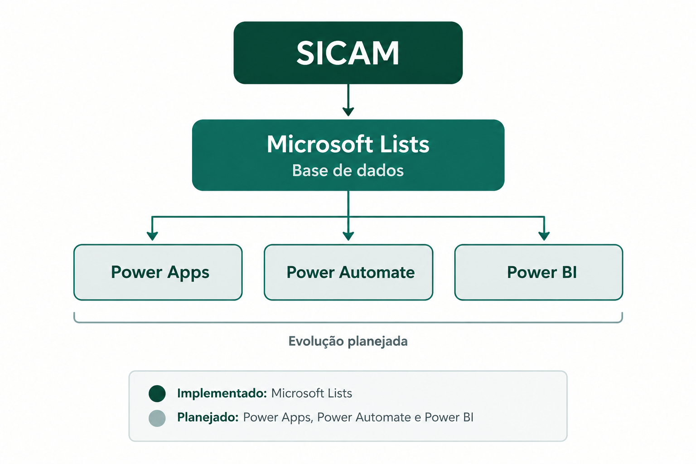

# Arquitetura conceitual

A arquitetura atual do projeto utiliza o Microsoft Lists como estrutura de armazenamento e gerenciamento dos dados.

A evolução planejada considera a utilização de ferramentas do ecossistema Microsoft 365.

## Visão geral da arquitetura

O diagrama representa a evolução planejada da solução. As integrações futuras ainda não estão implementadas.
